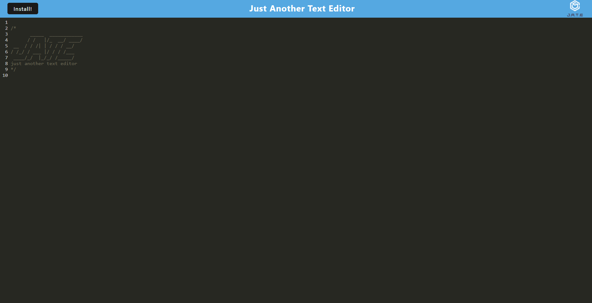

# Text Editor

## Description
The Text Editor app is a progressive web application that allows user to write text on the UI and have it saved into an IndexedDB to be retrieved at later visits. This application can also be installed from the browser to be accessed locally.

## Installation
The application can be accessed at the following link: https://protected-island-28364.herokuapp.com/

## Usage
When visiting the application for the first time, users are presented with the JATE header. Typing text and clicking out of the DOM will allow the app to save the text inside of the IndexedDB in the browser. When the application is closed and reopened again, the text will be retrieved from the database and rendered onto the DOM. The app can also be installed from the browser by clicking the install button on the top left of the page.

Homepage:

## Credits
N/A

## License
N/A

## Questions
For questions, please email me at sary.mony@gmail.com

For other projects, please check out my GitHub at [github.com/monysary](github.com/monysary)